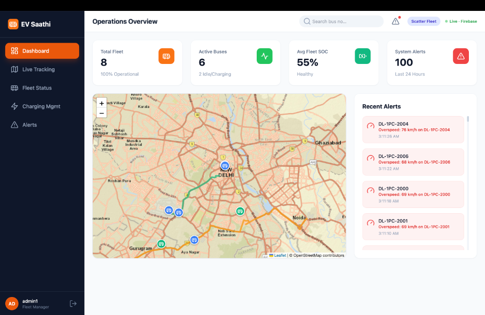
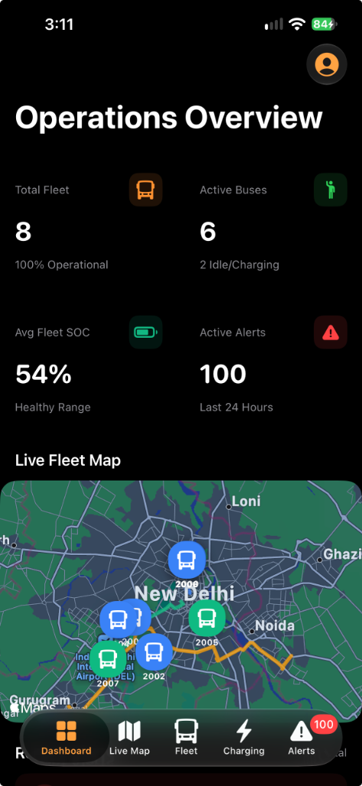
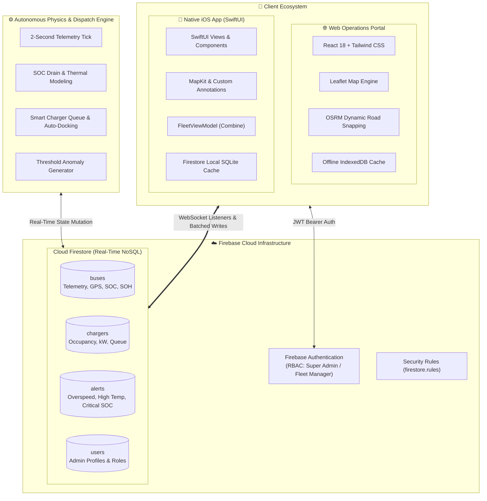

<div align="center">

# ⚡ EV Saathi — Fleet & Charging Operations Hub

**Enterprise-Grade Real-Time Electric Vehicle Fleet Telematics & Smart Charging Infrastructure Management System**

[](https://developer.apple.com/swift/)
[](https://developer.apple.com/ios/)
[](https://developer.apple.com/xcode/swiftui/)
[](https://react.dev/)
[](https://firebase.google.com/)
[](https://tailwindcss.com/)
[](https://leafletjs.com/)
[](LICENSE)

<br/>

[Live Overview](#-system-architecture) •
[Key Features](#-core-features) •
[Demo Credentials](#-demo-accounts--testing-credentials) •
[Web Dashboard](#-web-operations-dashboard) •
[iOS Native App](#-ios-native-app-swiftui) •
[Data Models](#-firestore-schema--data-models) •
[Contributing](#-contributing)

---

</div>

## 📌 Executive Overview

**EV Saathi** (*Electric Vehicle Companion*) is an end-to-end, cross-platform transit monitoring and fleet telematics platform engineered for modern public electric transit systems. Designed around high-density metropolitan transit corridors (modeled after the Delhi NCR capital region), EV Saathi solves critical operational bottlenecks in electric public mobility: **real-time battery depletion management**, **autonomous fast-charger slot allocation**, **telemetry anomaly detection**, and **multi-operator situational awareness**.

The platform is architected around a synchronized dual-client model:
1. **Web Operations Command Portal**: A lightweight, high-performance operations dashboard built with **React 18**, **Tailwind CSS**, and **Leaflet / OSRM** dynamic route-snapping maps.
2. **Native iOS App**: A native mobile command center built with **SwiftUI**, **MapKit**, **Combine**, and **Firebase SDK**, designed for fleet managers in the field.
3. **Synchronized Real-Time Cloud Engine**: Powered by **Google Cloud Firestore** and **Firebase Authentication**, delivering bi-directional sub-second telemetry streaming, offline cache resilience, and role-based access control.

<br/>

<div align="center">
  
  <br/>
  
</div>
---

## 🏗️ System Architecture



---

## ✨ Core Features

| Feature | Description | Web | iOS |
|---|---|:---:|:---:|
| **Live Vehicle Telemetry** | 2-second streaming updates of vehicle coordinates, velocity, battery SOC, pack temperature, and route progress. | ✅ | ✅ |
| **Road-Snapped GPS Tracking** | Real-world road geometry integration using Open Source Routing Machine (OSRM) and MapKit polyline snapping. | ✅ | ✅ |
| **Smart Charging Queue** | Automated routing to nearest 150 kW DC charger when battery dips to critical levels, and auto-release at 95% SOC. | ✅ | ✅ |
| **Predictive Alert Engine** | Instant incident logging for overspeed (>60 km/h), pack overheating (>45°C), and low battery reserve (<15%). | ✅ | ✅ |
| **Cross-Platform Sync** | Dual-way instant synchronization: any action taken on Web instantly reflects on iOS devices and vice versa. | ✅ | ✅ |
| **Offline-First Resilience** | Native on-device disk caching ensures full operational visibility in underground depots and zero-connectivity zones. | ✅ | ✅ |
| **Vehicle Profile Modals** | Deep-dive telemetry inspection: driver identification, battery State of Health (SOH), lifetime mileage, and maintenance logs. | ✅ | ✅ |
| **Role-Based Access Control** | Authenticated admin roles (Super Admin vs. Fleet Manager) enforced by Cloud Firestore Security Rules. | ✅ | ✅ |
| **Fleet Scatter Testing** | One-tap fleet randomized redistribution tool to test peak load and charging station queueing behaviors. | ✅ | ✅ |

---

## 🔐 Demo Accounts & Testing Credentials

The system comes pre-configured with three role-based administrative accounts ready for immediate testing across Web and iOS:

| Name | Role | Email Address | Password | Permissions |
|---|---|---|---|---|
| **Abhyuday Taneja** | **Super Admin** | `admin1@evosaathi.com` | `Admin@1234` | Full access, user administration, security policy controls |
| **Priya Mehta** | **Fleet Manager** | `admin2@evosaathi.com` | `Admin@1234` | Live dispatch, charger monitoring, incident management |
| **Ravi Shankar** | **Fleet Manager** | `admin3@evosaathi.com` | `Admin@1234` | Live dispatch, charger monitoring, incident management |

> [!TIP]
> On the Web Login Screen, quick-login buttons allow one-click testing without manual typing. On the iOS App, tap **"Initialize Demo Data"** on first launch to automatically populate Firestore with the initial 8 buses, 4 charging hubs, and demo admin profiles!

---

## 🌐 Web Operations Dashboard

The web portal is a standalone, client-side single-page application built for operations control rooms. It requires **no build step** or heavy tooling, running straight in any modern browser.

### Key Capabilities
- **Operations Overview**: High-level KPI summary cards (Total Fleet, Active In-Transit Buses, Fleet Average SOC %, System Alerts in last 24h).
- **Leaflet & ArcGIS Mapping**: Satellite & street map rendering with colored route lines, animated vehicle pins, and hover inspection cards.
- **Fleet Table**: Filterable vehicle inventory table (All, Moving, Charging, Alert) with battery health visualizers.
- **Charging Management**: Grid view of charging bays displaying power output (150 kW), bay status, and currently attached vehicle registration number.
- **System Alerts Feed**: Real-time event stream categorized by alert severity with auto-updating timestamps.
- **Interactive Bus Inspector**: Comprehensive modal displaying driver info, real-time speed dial, battery temperature thermometer gauge, and individual vehicle event history.

### Quick Start (Web)

#### Option 1: Direct File Launch
Simply double-click [`index.html`](file:///Users/abhyudaytaneja/Desktop/Github%20Projects/Ev%20Saathi%20Dashboard/index.html) or open it with your favorite browser:
```bash
open index.html
```

#### Option 2: Local HTTP Server (Recommended)
Running through a local web server ensures optimal performance and prevents CORS restrictions on some browsers:

```bash
# Using Python
python3 -m http.server 8080

# Or using Node.js npx
npx serve .
```
Navigate to `http://localhost:8080` and log in with any demo credential.

---

## 📱 iOS Native App (SwiftUI)

The native iOS client is designed for field managers, mobile supervisors, and depot coordinators. Built from the ground up using **SwiftUI** and **MapKit**.

```
EVSaathi/
├── App/                  # Application lifecycle (EVSaathiApp, ContentView auth routing)
├── Auth/                 # Authentication views (LoginView, AuthViewModel)
├── Models/               # Pure Swift models (BusModel, ChargerModel, AlertModel, RouteModel, UserModel)
├── ViewModels/           # Central business logic (FleetViewModel, Combine bindings)
├── Views/                # Tabbed UI & Modals:
│   ├── DashboardView     # Fleet KPI cards and status breakdown
│   ├── LiveMapView       # MapKit live tracking with custom vehicle pin annotations
│   ├── FleetStatusView   # Searchable and filterable bus cards list
│   ├── BusDetailView     # Full-screen vehicle telemetry & diagnostic modal
│   ├── ChargingView      # Depot charger bay status cards
│   ├── AlertsView        # Real-time incident logs
│   └── AdminProfileView  # Administrator profile & account switching
├── Components/           # Reusable UI widgets (MetricCardView, BusAnnotationView, AlertRowView)
└── Services/             # Network & Persistence:
    ├── FirestoreService  # Firebase real-time listeners & offline configuration
    └── SeedService       # Automated seed runner for demo data
```

### Technical Specifications
- **Target Platform**: iOS 16.0+
- **Development Environment**: Xcode 15.0+ / macOS Sonoma or later
- **Language**: Swift 5.9+
- **Architecture**: MVVM + Combine + Repository Pattern
- **Dependencies**: Firebase iOS SDK (`FirebaseAuth`, `FirebaseFirestore`)

### iOS Setup Instructions

1. **Clone & Open Project**:
   ```bash
   cd "EVSaathi-iOS/EVSaathi"
   open EVSaathi.xcodeproj
   ```

2. **Verify Swift Package Dependencies**:
   Xcode will automatically resolve the Firebase SDK via Swift Package Manager:
   - `https://github.com/firebase/firebase-ios-sdk` (Version 10.0.0+)
   - Required products: `FirebaseAuth`, `FirebaseFirestore`

3. **Verify GoogleService-Info.plist**:
   Ensure `GoogleService-Info.plist` is bundled in the `EVSaathi` project target. *(Already included in the repository configuration).*

4. **Build & Run**:
   - Select your target simulator (e.g., iPhone 15 Pro) or a connected physical iOS device.
   - Press **⌘ + R** to build and run.
   - On first launch, tap **"Initialize Demo Data"** to automatically initialize Firestore collections!

---

## 🚌 Transit Corridors & Charging Depots

The platform simulates realistic transit loops across the National Capital Region (Delhi NCR):

### Transit Routes
| Route ID | Name | Waypoints | Color Code |
|---|---|---|---|
| **R1** | **Connaught Place Circle** | Inner & Outer Circles, Barakhamba, Janpath | `#3B82F6` (Blue) |
| **R2** | **IGI Airport Express** | Connaught Place ➔ Dhaula Kuan ➔ Terminal 3 | `#10B981` (Green) |
| **R3** | **Noida-Gurgaon Link** | Sector 18 Noida ➔ South Delhi ➔ Cyber City Gurugram | `#F59E0B` (Amber) |

### High-Power DC Charging Hubs
| Charger ID | Hub Name | Location | Power Rating |
|---|---|---|---|
| **CH-1** | Nehru Place Hub | South Delhi Transit Junction | 150 kW DC Fast Charger |
| **CH-2** | Cyber City Depot | DLF Cyber City, Gurugram | 150 kW DC Fast Charger |
| **CH-3** | Noida Sec 18 Depot | Sector 18 Metro Interchange, Noida | 150 kW DC Fast Charger |
| **CH-4** | Dwarka Sec 21 Depot | Sector 21 Multi-Modal Transit Hub | 150 kW DC Fast Charger |

---

## 🗄️ Firestore Schema & Data Models

### 1. `buses` Collection
```json
{
  "id": "DL-1PC-2001",
  "name": "Bus 2001",
  "routeId": "R1",
  "driverName": "Rajesh Kumar",
  "status": "Moving",          // "Moving" | "Charging" | "Idle" | "Alert"
  "latitude": 28.6315,
  "longitude": 77.2167,
  "heading": 85.0,
  "speed": 42.5,               // km/h
  "soc": 68.4,                 // State of Charge (%)
  "soh": 96,                   // State of Health (%)
  "temp": 38.2,                // Battery pack temperature (°C)
  "distanceTraveled": 34210,   // Cumulative kilometers
  "lastMaintenance": "2024-11-15",
  "pathIndex": 42,
  "targetIndex": 2
}
```

### 2. `chargers` Collection
```json
{
  "id": "CH-1",
  "name": "Nehru Place Hub",
  "location": "South Delhi",
  "power": 150,                // kW
  "isOccupied": true,
  "currentVehicle": "DL-1PC-2002"
}
```

### 3. `alerts` Collection
```json
{
  "id": "alert_x89a1",
  "busId": "DL-1PC-2003",
  "type": "temp",              // "speed" | "temp" | "soc"
  "message": "High Battery Temp: 48°C on DL-1PC-2003",
  "timestamp": "2024-11-20T14:32:00Z",
  "resolved": false
}
```

### 4. `users` Collection
```json
{
  "id": "usr_9921",
  "name": "Abhyuday Taneja",
  "email": "admin1@evosaathi.com",
  "role": "superadmin"         // "superadmin" | "admin"
}
```

---

## 🛡️ Security & Access Control

The repository includes a production-grade Cloud Firestore security rules file ([`EVSaathi-iOS/firestore.rules`](file:///Users/abhyudaytaneja/Desktop/Github%20Projects/Ev%20Saathi%20Dashboard/EVSaathi-iOS/firestore.rules)):

```javascript
rules_version = '2';
service cloud.firestore {
  match /databases/{database}/documents {

    function isAdmin() {
      return request.auth != null;
    }

    function isSuperAdmin() {
      return request.auth != null &&
        get(/databases/$(database)/documents/users/$(request.auth.uid)).data.role == 'superadmin';
    }

    // Telemetry and charging infrastructure access
    match /buses/{busId} { allow read, write: if isAdmin(); }
    match /chargers/{chargerId} { allow read, write: if isAdmin(); }
    match /alerts/{alertId} { allow read, write: if isAdmin(); }

    // User Profile RBAC
    match /users/{userId} {
      allow read:   if isAdmin();
      allow create: if isSuperAdmin();
      allow update: if request.auth.uid == userId || isSuperAdmin();
      allow delete: if isSuperAdmin();
    }
  }
}
```

---

## 📂 Repository Directory Layout

```
.
├── index.html                    # 🌐 Web Operations Center (Single-Page React App)
├── README.md                     # 📖 Project Documentation & Architecture Guide
├── fix_ios_queue.py              # 🛠️ Simulation helper: iOS charger queue constraints
├── fix_web_queue.py              # 🛠️ Simulation helper: Web charger queue constraints
├── fix_scatter.py                # 🛠️ Simulation helper: Web fleet scatter routine
├── replace_map.py                # 🛠️ Mapping engine integration script
└── EVSaathi-iOS/                 # 📱 Native iOS Swift Project
    ├── firestore.rules           # 🛡️ Firebase Security Rules
    ├── README.md                 # 📱 iOS-specific setup guide
    └── EVSaathi/
        ├── EVSaathi.xcodeproj    # 🛠️ Xcode Project configuration
        └── EVSaathi/
            ├── App/              # App delegates & entry point
            ├── Auth/             # Login & authentication state
            ├── Components/       # Modular SwiftUI components
            ├── Models/           # Data structs & OSRM routing client
            ├── Resources/        # Assets and metadata
            ├── Services/         # Firestore service & seed service
            ├── ViewModels/       # FleetViewModel real-time state engine
            └── Views/            # Tab views, modals, and admin profiles
```

---

## ⚡ Testing Real-Time Multi-Admin Synchronization

Experience the real-time capabilities of EV Saathi across devices:

1. **Launch the Web Dashboard**: Open `index.html` in your web browser and sign in as `admin1@evosaathi.com`.
2. **Launch the iOS App**: Run the app on an iOS Simulator or connected iPhone, signing in as `admin2@evosaathi.com`.
3. **Observe Live Telemetry**: Watch bus pins move smoothly along the roads simultaneously on both screens.
4. **Trigger Fleet Scatter**:
   - In the web top navigation bar, click the **"Scatter Fleet"** button.
   - Instantly watch the bus positions, speeds, and battery levels redistribute across both the web map and your iOS device screen!
5. **Observe Auto-Docking**: When a bus's battery level depletes to 0%, observe how it autonomously navigates to the nearest unoccupied charging hub (`CH-1` to `CH-4`), turns green (`Charging`), and releases once charged to 95%.

---

## 🗺️ Roadmap & Future Enhancements

- [ ] **AI-Powered Predictive Battery Degradation**: ML model predicting remaining useful battery life based on ambient temperature and driving style.
- [ ] **Driver Native Companion App**: Turn-by-turn navigation app for bus drivers with real-time station slot reservations.
- [ ] **Dynamic Time-of-Use Grid Pricing**: Smart charging scheduler aligning bus charging with low-cost solar / off-peak tariff hours.
- [ ] **Live Telematics OBD-II / CAN-Bus Ingestion**: Real-time MQTT telemetry bridge for direct hardware sensor integration on physical buses.

---

## 🤝 Contributing

Contributions are welcome! Please follow these steps:

1. Fork the repository.
2. Create a feature branch (`git checkout -b feature/dynamic-route-optimization`).
3. Commit your changes (`git commit -m 'feat: add dynamic route optimization'`).
4. Push to the branch (`git push origin feature/dynamic-route-optimization`).
5. Open a Pull Request.


<div align="center">
 
*Developed by [Abhyuday Taneja](https://github.com/Tanejaabhyuday)*

</div>
